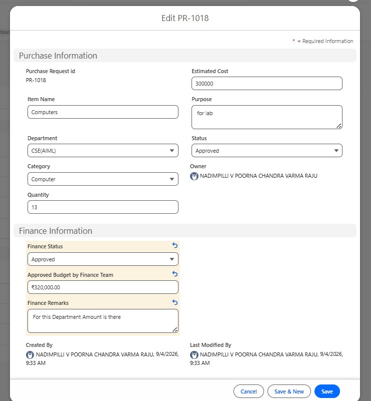
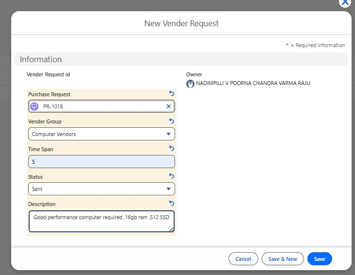
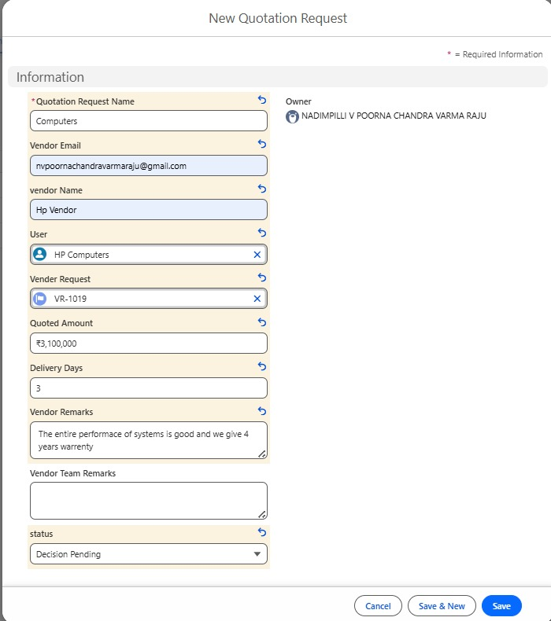
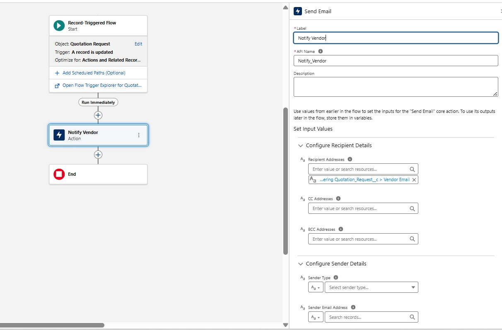
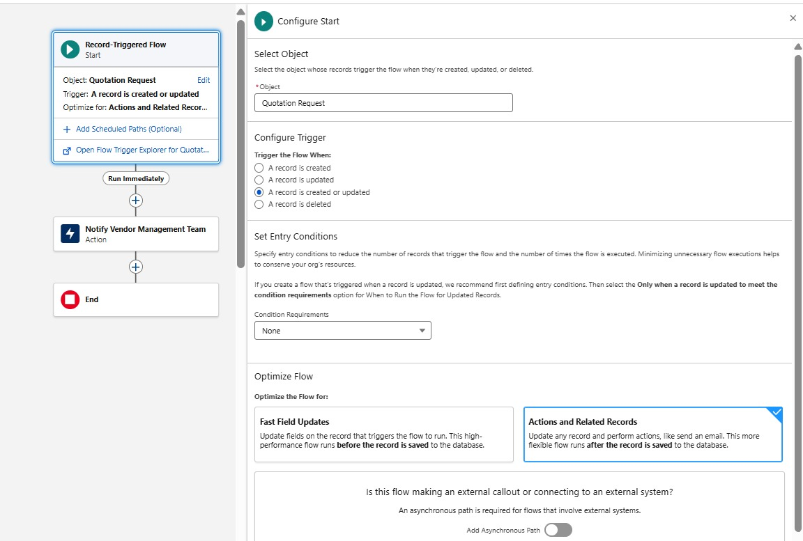

# Procurement & Vendor Management System

A Salesforce-based procurement management solution designed to digitize
and automate the end-to-end procurement lifecycle --- from departmental
purchase requests and financial approval to vendor quotation management
and agreement acceptance.

> **Platform:** Salesforce\
> **Primary Automation:** Salesforce Flow / Record-Triggered Flow\
> **Architecture:** User Layer → Application Layer → Data Layer →
> Automation Layer

------------------------------------------------------------------------

## 📌 Project Overview

Manual procurement processes become difficult to manage when multiple
departments, finance teams, vendors, and management stakeholders are
involved.

This project implements a centralized **Procurement and Vendor
Management System on Salesforce** to streamline:

-   Purchase request creation
-   Management approval
-   Finance/budget verification
-   Vendor quotation requests
-   Vendor quotation submission
-   Quotation evaluation and decision-making
-   Automated email notifications
-   Agreement generation and vendor acceptance

The system is designed around Salesforce's configurable data model,
role-based access, and Flow automation capabilities.

------------------------------------------------------------------------

## 🎯 Objectives

1.  Digitize the procurement request lifecycle.
2.  Provide controlled access based on user responsibilities.
3.  Introduce a structured finance approval stage.
4.  Allow the Vendor Management Team to request quotations from relevant
    vendors.
5.  Enable vendors to submit quotations through the system.
6.  Automate stakeholder notifications using Record-Triggered Flows.
7.  Support quotation review and vendor selection.
8.  Complete the process through agreement generation and vendor
    acceptance.

------------------------------------------------------------------------

## 🏗️ System Architecture

The application is organized into four logical layers.

``` text
┌─────────────────────────────────────────────┐
│                 USER LAYER                  │
│ HOD | Principal | Finance | Vendor Team     │
│                 | Vendors                   │
└──────────────────────┬──────────────────────┘
                       ↓
┌─────────────────────────────────────────────┐
│             APPLICATION LAYER               │
│ Purchase Request → Finance → Vendor Request │
│ → Quotations → Agreement                    │
└──────────────────────┬──────────────────────┘
                       ↓
┌─────────────────────────────────────────────┐
│                DATA LAYER                   │
│ Purchase Request | Vendor Request           │
│ Quotation Request | Agreement | Vendor      │
└──────────────────────┬──────────────────────┘
                       ↓
┌─────────────────────────────────────────────┐
│             AUTOMATION LAYER               │
│       Salesforce Record-Triggered Flows     │
│          + Automated Email Alerts            │
└─────────────────────────────────────────────┘
```

### High-Level Process

``` text
HOD
 │
 ▼
Purchase Request
 │
 ▼
Principal Approval
 │
 ├── Rejected ──► End
 │
 ▼
Finance Verification
 │
 ├── Rejected ──► End
 │
 ▼
Vendor Management Team
 │
 ▼
Vendor Request
 │
 ▼
Automated Vendor Notification
 │
 ▼
Vendor Quotation Submission
 │
 ▼
Automated Team Notification
 │
 ▼
Quotation Evaluation
 │
 ├── Rejected
 │
 └── Approved
       │
       ▼
Agreement Generation
       │
       ▼
Vendor Review & Acceptance
       │
       ▼
Procurement Completed
```

------------------------------------------------------------------------

## 👥 User Roles

  -----------------------------------------------------------------------
  Role                                Responsibility
  ----------------------------------- -----------------------------------
  **HOD**                             Creates and manages purchase
                                      requests

  **Principal**                       Reviews and approves/rejects
                                      purchase requests

  **Finance Team**                    Verifies budget availability and
                                      approves/rejects finance requests

  **Vendor Management Team**          Creates vendor requests, reviews
                                      quotations, and generates
                                      agreements

  **Vendor**                          Receives quotation requests,
                                      submits quotations, and accepts
                                      agreements
  -----------------------------------------------------------------------

------------------------------------------------------------------------

## 🧩 Functional Modules

### 1. Purchase Request Module

Used by the HOD to create procurement requests.

The Principal can review the request and approve or reject it by
updating its status.

**Key capabilities:** - Request creation - Item and quantity capture -
Category and department classification - Estimated cost tracking -
Purpose/requirement description - Approval status management - Finance
status tracking

------------------------------------------------------------------------

### 2. Finance Module

The Finance Team validates the financial feasibility of an approved
purchase request.

**Key capabilities:** - Budget verification - Finance
approval/rejection - Approved budget recording - Finance remarks

------------------------------------------------------------------------

### 3. Vendor Request Module

Used by the Vendor Management Team to initiate quotation requests for
approved purchase requests.

**Key capabilities:** - Link vendor request to a Purchase Request -
Select vendor category/group - Add request description - Define response
time span - Track request status

------------------------------------------------------------------------

### 4. Quotation Module

Used by vendors to submit quotations against a Vendor Request.

**Key capabilities:** - Vendor identification - Vendor email - Quoted
amount - Delivery timeline - Vendor remarks - Vendor Management Team
remarks - Quotation decision status

------------------------------------------------------------------------

### 5. Agreement Module

After a quotation is approved, the Vendor Management Team creates an
Agreement record for the selected vendor.

The vendor reviews and accepts the agreement, completing the procurement
process.

------------------------------------------------------------------------

## 🗃️ Salesforce Data Model

### Purchase Request

  Field                             Type
  --------------------------------- ----------------
  Purchase Request ID               Auto Number
  Request Name                      Text
  Category                          Picklist
  Department                        Picklist
  Item Name                         Text
  Quantity                          Number\*
  Estimated Cost                    Currency\*
  Purpose                           Text Area
  Status                            Picklist
  Finance Status                    Picklist
  Approved Budget by Finance Team   Currency
  Finance Remarks                   Long Text Area

**Status values:** `Pending Approval` → `Approved` / `Rejected` →
`Vendor Processing` → `Complete`

**Finance Status values:** `Decision Pending` / `Approved` / `Rejected`

> *The project documentation identifies Quantity and Estimated Cost as
> fields currently represented as text and planned for conversion to
> Number and Currency respectively.*

------------------------------------------------------------------------

### Vendor Request

Custom Salesforce object used to request quotations from vendors.

  Field               Type
  ------------------- ---------------------------
  Vendor Request ID   Auto Number
  Purchase Request    Lookup → Purchase Request
  Description         Long Text Area
  Status              Picklist
  Time Span           Number
  Vendor Group        Picklist

**Status values:** `Draft` / `Sent` / `Closed`

**Vendor Groups:** - Computer Vendors - Furniture Vendors

------------------------------------------------------------------------

### Quotation Request

Custom Salesforce object used for vendor quotation submissions.

  Field                  Type
  ---------------------- -------------------------
  Quotation Request ID   Auto Number
  Vendor Name            Text
  Vendor Email           Email
  Vendor Request         Lookup → Vendor Request
  User                   Lookup → User
  Quoted Amount          Currency
  Delivery Days          Number
  Vendor Remarks         Long Text Area
  Vendor Team Remarks    Long Text Area
  Status                 Picklist

**Status values:** `Decision Pending` / `Approved` / `Rejected`

------------------------------------------------------------------------

## 🔗 Object Relationship

A **Lookup Relationship** is implemented between **Vendor Request** and
**Quotation Request**.

``` text
Purchase Request
       │
       │ Lookup
       ▼
Vendor Request
       │
       │ Lookup
       ▼
Quotation Request
```

This relationship allows quotation records to be associated with the
corresponding vendor request and enables the Vendor Management Team to
review and process quotations in context.

------------------------------------------------------------------------

## ⚙️ Salesforce Automation

The solution uses **Record-Triggered Flows** to automate communication
between stakeholders.

### Flow 1 --- Vendor Request Notification

**Trigger:** A Vendor Request record is created.

**Process:**

``` text
Vendor Request Created
        ↓
Check Vendor Group
        ↓
Computer Vendors ──► Send Computer Vendor Email
        ↓
Other/Default ─────► End
```

The flow automatically sends an email notification to vendors associated
with the selected category/group.

------------------------------------------------------------------------

### Flow 2 --- Quotation Notification to Vendor Management Team

**Trigger:** A Quotation Request record is created.

**Process:**

``` text
New Quotation Submitted
        ↓
Notify Vendor Management Team
        ↓
Team Reviews Quotation
```

The notification includes relevant quotation information such as:

-   Vendor Name
-   Quoted Amount

------------------------------------------------------------------------

### Flow 3 --- Vendor Notification After Team Update

**Trigger:** A Quotation Request record is updated by the Vendor
Management Team.

**Process:**

``` text
Quotation Updated
       ↓
Notify Vendor
       ↓
Vendor Receives Updated Details
```

The notification includes:

-   Vendor Name
-   Quoted Amount
-   Vendor Team Remarks
-   Updated quotation details

------------------------------------------------------------------------

## 🔐 Access & Security Model

The project uses Salesforce **Profiles and role-specific permissions**
to control access to objects and records.

### HOD

-   Access to Purchase Request
-   Create, Read, Edit, Delete permissions on Purchase Request records

### Principal

-   Access to Purchase Request
-   Read/Edit permissions
-   Approval/rejection through the request status

### Vendor Management Team

-   Access to Purchase Request and Vendor Request
-   Create, Read, Edit, Delete permissions on Vendor Request records

### Finance Team

-   Access to Purchase Request
-   Read/Edit permissions
-   Finance approval/rejection
-   Ability to update approved budget and finance remarks

### Public Groups

Configured vendor groups include:

``` text
Computer
├── Dell Vendors
└── HP Vendors

Furniture
└── BKP Furniture
```

> **Security note:** Credentials from project documentation are
> intentionally excluded from this README. Never commit Salesforce
> usernames, passwords, secrets, session tokens, or API credentials to a
> public repository.

------------------------------------------------------------------------

## 🎨 Salesforce UI Configuration

The project includes dedicated page layouts for the custom objects:

-   **Purchase Request Layout** --- fields organized into a structured
    section.
-   **Vendor Request Layout** --- fields organized into a structured
    section.

------------------------------------------------------------------------

## 🔄 End-to-End Workflow

### Step 1 --- Purchase Request

The HOD creates a Purchase Request.

### Step 2 --- Management Approval

The Principal reviews the request and approves or rejects it.

### Step 3 --- Finance Verification

Finance checks budget availability and updates the Finance Status.

### Step 4 --- Vendor Request

For finance-approved requests, the Vendor Management Team creates a
Vendor Request.

### Step 5 --- Vendor Notification

A Record-Triggered Flow automatically notifies relevant vendors.

### Step 6 --- Quotation Submission

Vendors submit their quotations through the Quotation Request module.

### Step 7 --- Team Notification

A Record-Triggered Flow notifies the Vendor Management Team when a
quotation is submitted.

### Step 8 --- Quotation Evaluation

The Vendor Management Team reviews and approves or rejects the
quotation.

### Step 9 --- Vendor Notification

The system automatically notifies the vendor about the quotation
decision and relevant remarks.

### Step 10 --- Agreement

For an approved quotation, the Vendor Management Team creates an
Agreement record.

### Step 11 --- Completion

The selected vendor reviews and accepts the agreement, completing the
procurement process.

------------------------------------------------------------------------

## 📸 Screenshots

Add your Salesforce screenshots to the repository and update the paths
below.

### Salesforce Home / Application

``` markdown

```


### Purchase Request

``` markdown

```


### Vendor Request

``` markdown

```


### Quotation Request

``` markdown

```


### Salesforce Flow --- Vendor Notification

``` markdown

```


### Salesforce Flow --- Quotation Notification

``` markdown

```


### Agreement

``` markdown

```


> **Screenshot upload option:** Create a `screenshots/` folder in the
> GitHub repository and upload PNG/JPG screenshots there. Replace the
> placeholder filenames above with your actual screenshot names.

------------------------------------------------------------------------

## 📁 Recommended Repository Structure

``` text
procurement-vendor-management/
│
├── README.md
│
├── screenshots/
│   ├── salesforce-home.png
│   ├── purchase-request.png
│   ├── vendor-request.png
│   ├── quotation-request.png
│   ├── vendor-notification-flow.png
│   ├── quotation-notification-flow.png
│   └── agreement.png
└── docs/
    └── architecture.md
```

------------------------------------------------------------------------

## 🛠️ Technology Stack

  Technology                      Usage
  ------------------------------- --------------------------------------
  **Salesforce Platform**         Core application platform
  **Salesforce Custom Objects**   Procurement and quotation data model
  **Lookup Relationships**        Object association
  **Salesforce Profiles**         Role-based access control
  **Public Groups**               Vendor categorization/grouping
  **Page Layouts**                User interface configuration
  **Salesforce Flow**             Business process automation
  **Record-Triggered Flow**       Event-driven automation
  **Email Alerts/Actions**        Automated stakeholder notifications

------------------------------------------------------------------------

## 🚀 Deployment / Setup

The project is configured as a Salesforce-based solution.

For a Salesforce DX source-controlled implementation, a recommended
setup is:

``` bash
# Authenticate with Salesforce
sf org login web

# Deploy metadata to the target org
sf project deploy start

# Run Apex tests, if Apex is introduced
sf apex run test
```

> The provided project documentation focuses on Salesforce
> configuration, objects, profiles, layouts, public groups, and flows.
> It does not document a complete Salesforce DX deployment package or
> Apex implementation, so deployment commands above represent the
> recommended Salesforce DX workflow rather than documented
> project-specific commands.

------------------------------------------------------------------------

## 🧪 Testing Scenarios

  -----------------------------------------------------------------------
  Test Case                           Expected Result
  ----------------------------------- -----------------------------------
  HOD creates Purchase Request        Request is created successfully

  Principal approves request          Status becomes Approved

  Principal rejects request           Status becomes Rejected

  Finance approves request            Finance Status becomes Approved

  Finance rejects request             Finance Status becomes Rejected

  Vendor Request created              Relevant vendor notification is
                                      triggered

  Vendor submits quotation            Vendor Management Team receives
                                      notification

  Team updates quotation              Vendor receives updated quotation
                                      information

  Quotation approved                  Agreement can be generated

  Vendor accepts Agreement            Procurement process is completed
  -----------------------------------------------------------------------

------------------------------------------------------------------------

## 📊 Key Benefits

-   **Centralized procurement:** Procurement information is maintained
    within Salesforce.
-   **Reduced manual communication:** Flow automation handles important
    email notifications.
-   **Controlled access:** Users interact with the system according to
    their responsibilities.
-   **Structured approval process:** Management and Finance stages are
    explicitly represented.
-   **Vendor collaboration:** Vendors can participate in quotation
    submission and agreement acceptance.
-   **Traceable lifecycle:** Purchase requests move through defined
    procurement stages.
-   **Scalable architecture:** Salesforce objects, relationships,
    profiles, and Flow automation can be extended as requirements grow.

------------------------------------------------------------------------

## 🔮 Future Enhancements

Potential improvements for a production-grade implementation include:

-   Convert remaining text-based numeric fields to **Number/Currency**
    data types.
-   Introduce **Permission Sets** for more granular access control.
-   Add **Validation Rules** for mandatory business conditions.
-   Implement approval processes using **Salesforce Flow
    Approval/Approval capabilities** where appropriate.
-   Add quotation comparison views and dashboards.
-   Add vendor performance tracking.
-   Introduce purchase-order generation after agreement acceptance.
-   Add audit/history tracking for critical status changes.
-   Implement automated reminders based on quotation deadlines.
-   Add reports and dashboards for procurement KPIs.
-   Improve vendor self-service using an appropriate Salesforce
    Experience Cloud architecture.
-   Add automated test coverage if Apex or additional metadata
    automation is introduced.

------------------------------------------------------------------------

## 📌 Project Status

**Current implementation includes:**

-   [x] Purchase Request object
-   [x] Vendor Request object
-   [x] Quotation Request object
-   [x] Lookup relationship between Vendor Request and Quotation Request
-   [x] Role-specific Salesforce profiles
-   [x] Public vendor groups
-   [x] Page layouts
-   [x] Vendor Request notification Flow
-   [x] Quotation submission notification Flow
-   [x] Vendor update notification Flow
-   [x] End-to-end procurement workflow
-   [x] Agreement stage

------------------------------------------------------------------------

## 👨‍💻 Project Summary

The **Procurement & Vendor Management System** demonstrates how
Salesforce can be configured as an enterprise procurement workflow
platform by combining:

**Custom Data Modeling + Role-Based Access + Salesforce Flow
Automation + Email Notifications + Vendor Collaboration**

The implementation transforms a manual procurement process into a
structured, traceable, and automated workflow.

------------------------------------------------------------------------

## ⭐ Repository Presentation Tip

For a strong GitHub project presentation, place your **best Salesforce
screenshots near the top** of the README and include screenshots of:

1.  Purchase Request record
2.  Principal approval/status
3.  Finance approval
4.  Vendor Request
5.  Vendor quotation
6.  Flow Builder automation
7.  Agreement record

This makes the repository immediately understandable to recruiters and
Salesforce developers.
